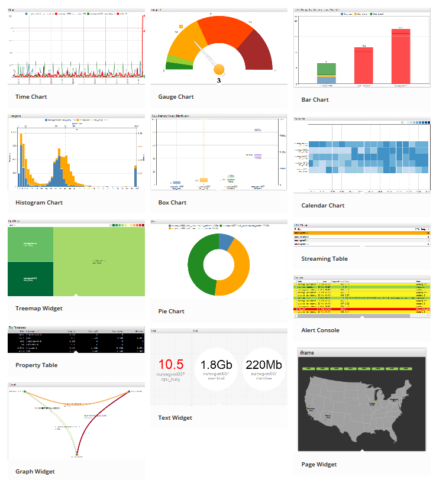

Data Visualization with Chart Lab
==================================

###Introduction###
------------------

Are you looking for clear and concise graphical presentation for your datasets? Are wanting to explore different graphical outputs **all in one place** for your data?

Chart Lab is just the thing you have been looking for!

Chart Lab is a versatile online tool which allows users to try out Axibase Time Series Database (ATSD) visualization capabilites. Chart Lab doesn't require any
registration and allows you to experiment with different layouts and widget settings prior to deploying it in your own ATSD instance.

The purpose of this article is to walk through and showcase all of the different features of Chart Lab.

###Chart Lab Features###
------------------------

A blank, customizeable Chart Lab portal for your use can be found here: **[BLANK](https://apps.axibase.com/chartlab/)**

Within Chart Lab each of the following items are included:

* Source – switch between data sources: random and ATSD
* Widget – append a sample widget to the current configuration
* Clone – save current configuration in a new directory
* Save – save current configuration under a new revision in the current directory
* Run - apply and view a portal based on current configuration
* Editor - toggle configuration editor

Below is an image of the standard Chart Lab configuraton.

 

###Source###
------------

Chart Lab supports two data sources:

1. Random data generator
2. ATSD with real, continuously updated data

The Random data generator is a non-existent data set which invokes the math.random() javascript. As defined by the [Mozilla Developer Network](https://developer.mozilla.org/en-US/docs/Web/JavaScript/Reference/Global_Objects/Math/random), 
this function returns a floating-point, pseudo-random number in the range [0,1], which is inclusive from 0 up to but not including 1. This range can 
be scaled to fit any desired dataset. These numbers have no meaning or value; every 60 seconds new random numbers are generated with the goal of merely
providing different ranges for visualization purposes. 
  
The ATSD data is real life data. The user is able to draw upon Axibase datasets. Once the user installs ATSD, they will be able to pull in their own data, which
will be updated in real time as data is added to their datasets.

###Widget###
------------

Chart Lab contains each of the following Widgets, as shown in the image below. Widgets are 

Visualizations for each of these Widgets are displayed in the following link:
     
[https://axibase.com/products/axibase-time-series-database/visualization/widgets/](https://axibase.com/products/axibase-time-series-database/visualization/widgets/)

