Data Visualization with Chart Lab
==================================

### Introduction
------------------

Are you looking for clear and concise graphical presentations for your datasets?

Are you wanting to explore different graphical outputs **all in one place**?

Chart Lab is a versatile online tool which allows users to try out Axibase Time Series Database (ATSD) visualization capabilities. Chart Lab doesn't require any
registration and allows you to experiment with different layouts and widget settings prior to deploying it in your own ATSD instance. For front-end developers familiar with
[jsfiddle.net](http://jsfiddle.net/da1rosy8/), Chart Lab shares many of the same properties and characteristics.

The purpose of this article is to walk through and showcase all of the different features of Chart Lab.

### Chart Lab Features###
------------------------

A blank, customizable Chart Lab portal for your use can be found here:

The Chart Lab menu contains the following items:

* Editor - toggle configuration editor
* Run - apply and view a portal based on current desired configuration
* Save - save current configuration under a new revision in the current directory
* Clone - save current configuration in a new directory
* Widget - append a sample widget to the current desired configuration
* Source - switch between data sources: Random and ATSD

Below is an image of the standard default Chart Lab configuration.

We will run through each of the features of Chart Lab, starting with **Source**.

### Source
------------

Chart Lab supports two data sources:

1. Random Data Generator
2. ATSD with real, continuously updated data

The Random data generator is a non-existent data set which invokes the math.random() javascript function. As defined by the [Mozilla Developer Network](https://developer.mozilla.org/en-US/docs/Web/JavaScript/Reference/Global_Objects/Math/random),
this function returns a floating-point, pseudo-random number in the range [0,1], which is inclusive from 0 up to but not including 1. This range can
be scaled to fit any desired dataset. These numbers have no meaning; every 60 seconds new random numbers are generated with the goal of merely
providing different ranges for visualization purposes.

The ATSD data is live data collected by Axibase from a variety of sources, including server equipment, network devices, and online resources. Using Chart Lab, the user is able to draw upon a publicly accessible ATSD instance operated by Axibase. Once the user installs ATSD, they will be able to pull in
their own data, which will be updated in real time as data is added to their datasets.

### Widget
------------

Chart Lab contains each of the following **Widgets**, as shown in the image below.

These visualizations can be found at the following link:

[https://axibase.com/products/axibase-time-series-database/visualization/widgets/](https://axibase.com/products/axibase-time-series-database/visualization/widgets/)

To add a Widget, click the Widget drop-down and select your desired Widget.

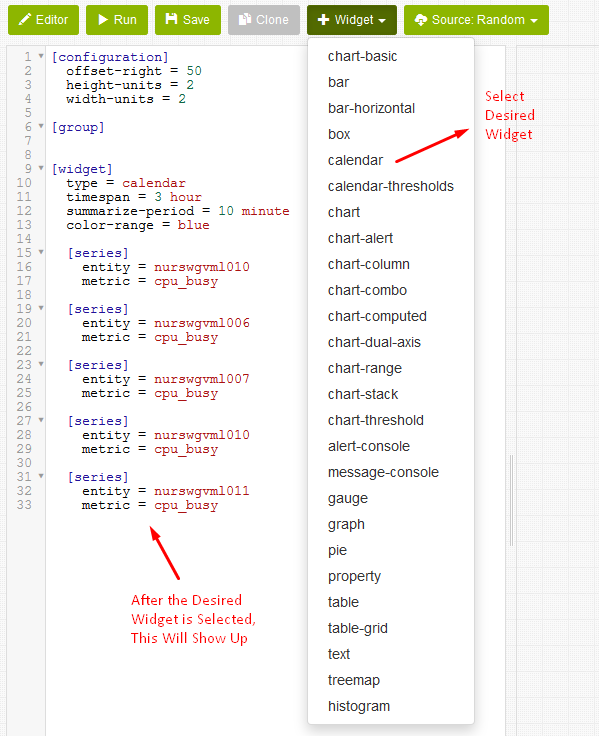

### Run
---------

Once a **Source** and **Widget** have been selected, the user may then select **Run** to render a visualization. This will display a portal based on the current
Widget configuration.

### Widget Settings
------------

We will now run through several settings for Widgets in Chart Lab.

Widgets are always added to the bottom of the configuration. In the figure below, a chart Widget was initially added, followed by a histogram Widget.

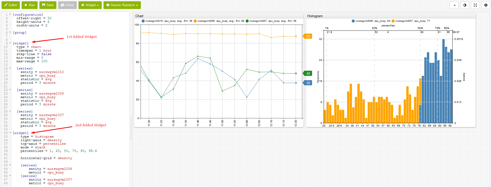

As the default setting, Widgets are arranged in a single horizontal line. In order to split the Widgets up into several different lines, you must add
a new **group** to the configuration. In the image below, a third pie chart Widget was added in the Chart Lab configuration; however, we cannot see the graphic of this Widget.

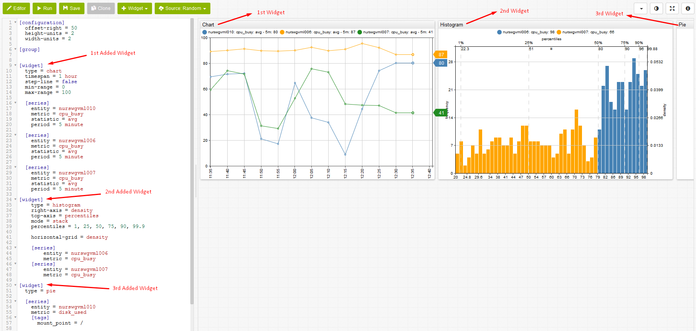

If we add a second group (as shown in the below image) and hit Run, we will have a configuration as shown below.

In order to fit more Widgets in a single view, you may change the **height-units** and **width-units** in the configuration. For example, if we change both
of these values from 2 to 4, we will have the configuration as shown below.

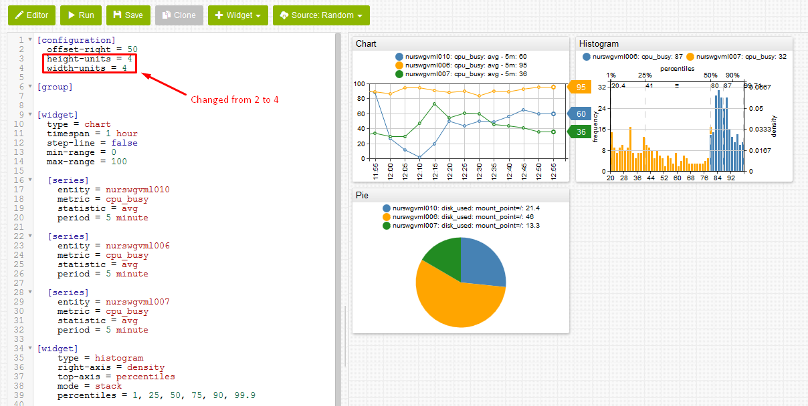

Single line comment start with **#**. Text after **#** will be ignored.

Multi-line comments start with / * and end with * /. Any text between / * and * / will be ignored.

The figure below shows two histogram Widgets. The histogram on the left has the right and top axis commented out.  

By selecting Ctrl + Space in the Chart Lab portal, a drop-down menu will appear. This drop-down contains the key sections of the configuration. Press
to select one of the sections.

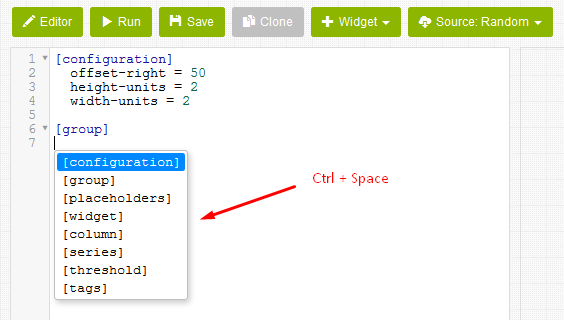

If you have a configuration that looks like the image below, there is a quick fix for this.

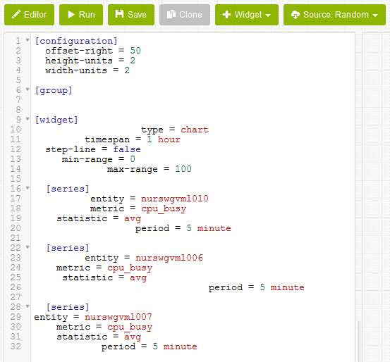

Press Ctrl + A to select all the text, then Shift + Tab to align the text.

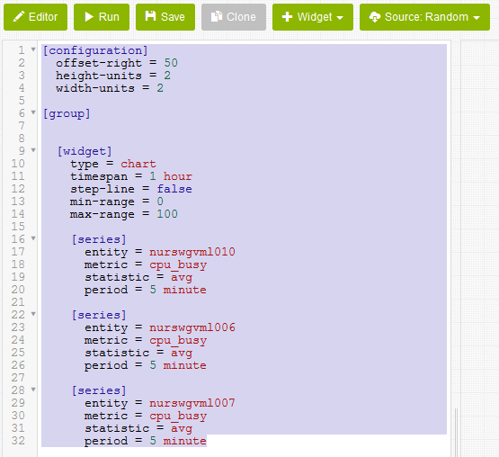

### Save
----------

After a visualization has been created, the user has the option of selecting **Save** to save the current configuration as a new revision in the current
directory. After pressing **Save**, the current configuration will be assigned a unique URL and a revision number. We will run through a quick example to
demonstrate this process.

1.	Open a blank Chart Lab portal.
2.	Select **Random** as the Source.
3.	Select **Run** to create a visualization.
4.	At this point, we have the option to save our current configuration. Select **Save**.

	After saving, our configuration has been assigned a unique URL and revision number, in this case:

	**[https://apps.axibase.com/chartlab/a9977177](https://apps.axibase.com/chartlab/a9977177)** and **1**.

	

	It is worth noting that for a Random Source, because of the math.random() javascipt function, unique values will not end up being saved. The configuration
	has been saved, but regardless random values will continue to be output after every 60 seconds.

	Let us continue with saving a second revision.

5.	Change Source to **ATSD**.
6.	Select **Save**.

	After saving for a second time, this second configuration has been assigned a unique URL and revision number, in this case:

	**[https://apps.axibase.com/chartlab/a9977177/2/](https://apps.axibase.com/chartlab/a9977177/2/)** and **2**.

	

	Since ATSD, which contains real data, was selected as the Source, the saved configuration will query the same data.

	Let us continue with saving a third revision.

7.	Change the **max-range** from 100 to 80.

	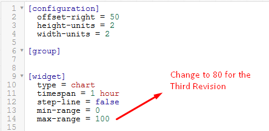

8.	Select **Save**.

	After saving for a third time, this third configuration has been assigned a unique URL and revision number, in this case:

	**[https://apps.axibase.com/chartlab/a9977177/3/](https://apps.axibase.com/chartlab/a9977177/3/)** and **3**.

	

	Now the user has the options of toggling between each of the three saved revisions. These three unique URLs will be stored permanently within the Chart Lab application.
	The user has the option of coming back to these examples at any time.

	

### Clone
-----------

By selecting **Clone**, the user is allowed to save the current configuration in a new directory. For example, if we clone the third revision from the previous section,
a new unique URL will be created, separate from the previous nested example.

In this unique case, the URL that was generated is listed below:

[https://apps.axibase.com/chartlab/3fa686a5](https://apps.axibase.com/chartlab/3fa686a5)

All the features of the cloned output are the same as the original, with the noteworthy point being that an entirely new directory was created as a result.

### Editor
------------

By selecting **Editor**, the user is allowed to display their configuration in fullscreen. By appending #fullscreen at the end of the Chart Lab URL
you can open the configuration in full-screen mode. To revert back to the standard view, click the **Editor** button once more.

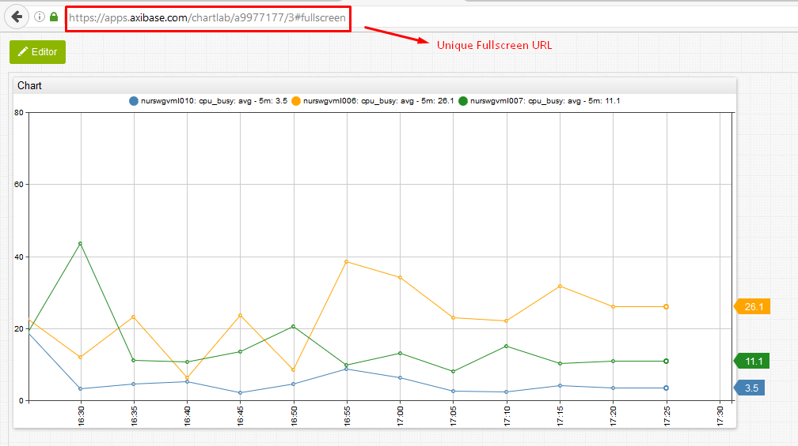

### Miscellaneous Features
--------------------------------------

In the upper right hand corner of the portal are three additional features that may be used to edit your visualization.

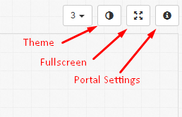

By clicking **Theme**, a black background will appear behind your visualization. Click **Theme** once more to remove the background.

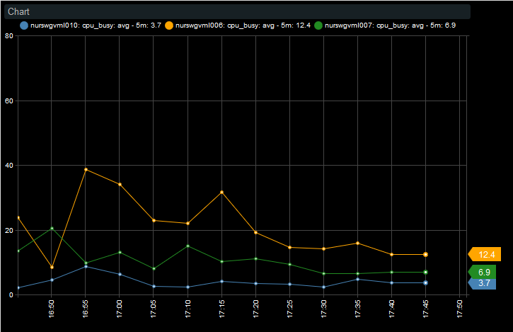

By clicking **Full Screen**, the user is allowed to display their visualization in fullscreen. Full Screen hides the Chart Lab features. To return to the standard Chart Lab view, press **Esc**.

Clicking the information icon takes you to **[Portal Settings](https://axibase.com/products/axibase-time-series-database/visualization/widgets/portal-settings/)** documentation.
This tab contains configuration settings and examples.

### Action Items
------------------

If this guide has been interesting to you, create an example and send it over to us. If you have any comments, questions, or concerns please do not hesitate
to [contact us](https://axibase.com/feedback/)!
