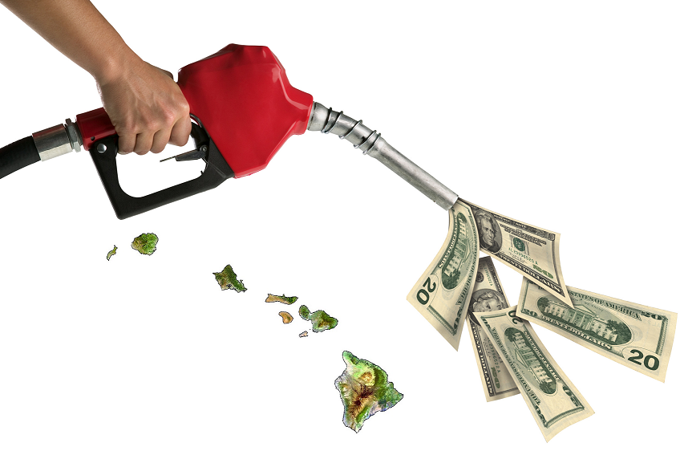
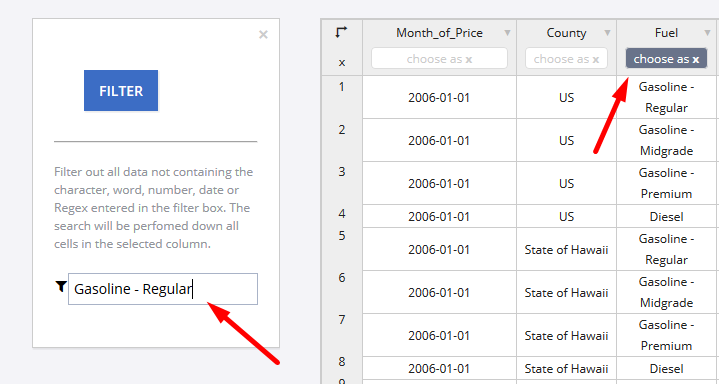
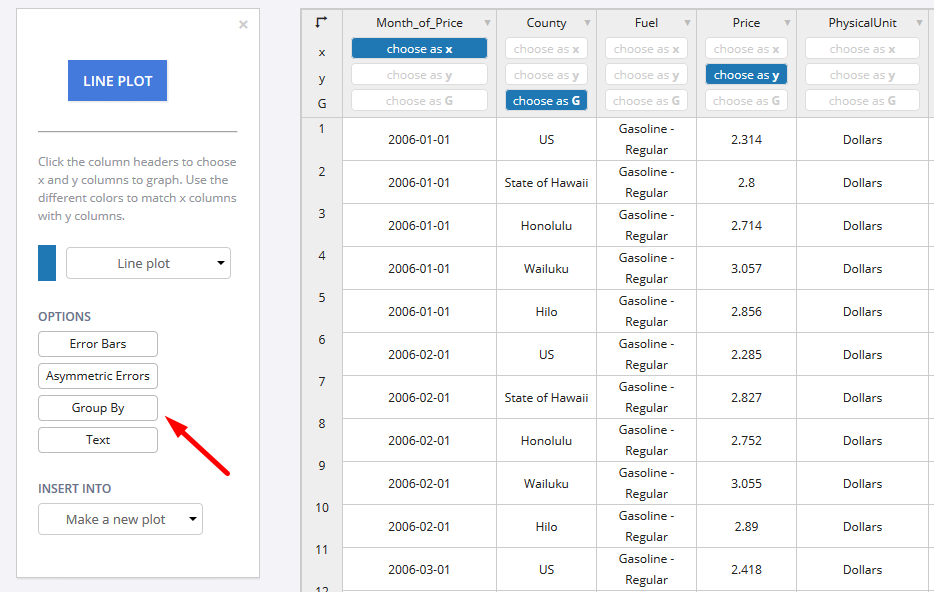
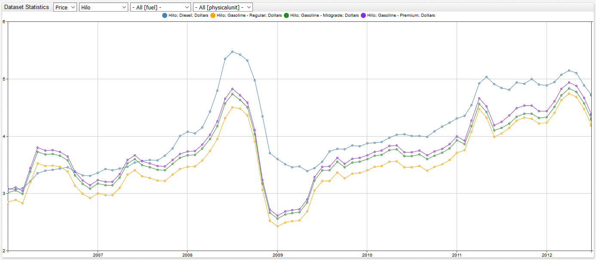
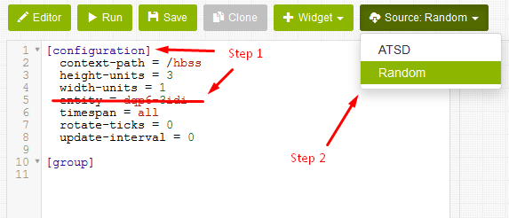

Pain at the Pump - a Closer Look at Hawaii's High Fuel Prices
=============================================================

###Introduction###
------------------

Hawaii. Sunshine. Beautiful beaches. Mai Tais. These are a few of the great motivators for moving to one of America's favorite vacation destinations. However,
Hawaii has some of the most expensive consumer products in the nation. According to [expastistan.com](https://www.expatistan.com/cost-of-living/comparison/new-york-city/honolulu), 
in comparison to New York City, Honolulu is more expensive by the percentages for the following items:

* 1 liter of whole fat milk: 41%
* 1 kg (2 lbs) of apples: 68%
* Bread for 2 people for 1 day: 67%

In addition to exorbitant food prices, Hawaii currently holds the crown of having the highest fuel prices in the entire United States, according to [gasbuddy.com](https://www.gasbuddy.com/USA). The Aloha state has long held the 
reputation of having the most expensive fuel in the land. However, until recently, such trends have been difficult to quantify.  In order to better analyze datasets such as Hawaiian fuel prices,
the US government in 2009 established a data collection website, [data.gov](https://www.data.gov/). Datasets are available online to conduct research, develop web applications, and design data visualizations, 
on a variety of topics ranging from agriculture, to manufacturing, to health, among many other.

From 2006 to 2012, the State of Hawaii compiled AAA fuel prices for each of the following fuel types:

**Diesel**, **Gasoline - Regular**, **Gasoline - Midgrade**, **Gasoline - Premium**

In turn, each of these fuel prices were recorded for the following locations:

**Hilo**, **Honolulu**, **Wailuku**, **US**, **State of Hawaii**

The dataset from data.gov can be found here: [http://catalog.data.gov/dataset/aaa-fuel-prices-52bf0](http://catalog.data.gov/dataset/aaa-fuel-prices-52bf0)

On the data.gov website, datasets can be downloaded as a CSV, RDF, JSON, or a XML file. To help interpret this data, the user is given the option of opening the CSV file with either [CartoDB](https://carto.com/) 
or [plotly](https://plot.ly/). 

###CartoDB###
-------------

CartoDB is primarily a mapping software and does not allow the user to plot the data set (in this case gas prices of Hawaii) over time. 

###plotly###
------------

plotly fairly easily allows the user to display the relationship of gas prices over time; however, without extensively manipulating the raw data set, each 
location is allowed to be compared with only one fuel type at a time. 

We will quickly run through plotting this dataset in plotly.

Once you click on the above dataset, you are given the option of choosing data.gov preview, plotly, or CartoDB. Choose **plotly**.

Once the raw data is opened via plotly, the user must select **Filter** from Data Tools, as shown below. 

Next, choose **Filter** by, in our case for example, Gasoline - Regular. You must click **choose as x** for **Fuel** so that plotly knows which column to filter.

Finally, to output the data, the user must select **Group By** and choose **Month_of_Price** as the x axis, **County** as G (this will separate the prices of fuel for each 
location), and the **Price** as the y axis.

 

The ouput will look as is shown below. The graph is relatively easy to interpret. The user can see that Gasoline - Regular fuel prices in Hawaii have for the last 6
years steadily remained more expensive than US average prices. The main drawback of using plotly to process datasets from data.gov seems to be the extensive
time and effort it would take to create outputs for each of the following fuel types. The same time consuming steps would have to be taken for analyzing Diesel,
Gasoline - Midgrade, and Gasoline - Premium between all 5 locations. The same cumbersome process would have to be followed for comparing fuel types for each particular location. Additionally,
data in plotly is static, that is every time the data is updated, everything will need to be replotted.

###Axibase's Time Series Database (ATSD)###
-------------------------------------------

The processing of datasets using Axibase's Time Series Database (ATSD) is much less cumbersome.  Processing the same data with ATSD is less time consuming 
because its collection tool has built-in heuristics to handle the format in which data.gov datasets are published, namely the Socrata Open Data Format. 
When loading data for a particular dataset the collector uses Socrata metadata to understand the meaning of columns and automatically extract dates, times, 
and categories from the data files. Besides, ATSD stores the data in the user's own database so that this public data can be combined with internal data 
sources as well as mixed and matched across different datasets. Once you install ATSD, you **don't** have to:

* Add additional datasets from data.gov
* Manipulate and design table schema
* Provision an application server
* Write programs to parse and digest these types of files. 

Rather, you can configure a scheduled job to retrieve the file from the specified endpoint and have ATSD parse it according to pre-defined rules. Once you
have raw data in ATSD, creating and sharing reports with built-in widgets is fairly trivial. The reports will be continuously updated as new data comes in.

With ATSD, the user is able display the dataset in an easily understandable manner. The below figure shows each fuel type for each of the 5 locations.

 

The dataset can be sorted by location and/or fuel type, and the user can easily toggle through comparing different scenarios. The next 2 figures show outputs
comparing fuel types at Hilo and Diesel prices by location, respectively.

Here, you can explore the complete dataset for Hawaiian fuel prices using our portal: 

###Creating Custom Portals###
-----------------------------

Custom portals can be created from the default portal. The user has the capability to change or display certain aspects of the dataset to their liking. For
example, the user may change graph styling, such as color, graph type, and other display options. 

Likewise, by customizing the data the way you want, you can filter out any unnessecary information. If, for example, you are interested only in fuel prices
at Hilo, you can customize your portal to only show that information without the effort to toggle through for it.

[DEFAULT](https://apps.axibase.com/chartlab/ee379926)

A blank, customizeable portal for your use can be found here: [BLANK](https://apps.axibase.com/chartlab/)

The default portal, from which you can customize the dataset results, again can be found here: [DEFAULT](https://apps.axibase.com/chartlab/ee379926)

We will walk through a brief example on how to customize the default dataset to only display fuel prices at Hilo:

1. Open the blank portal and copy **configuration** section from the default portal. Delete the **entity** line.
2. Change the Source from **Random** to **ATSD**.

3. Copy 

~~~python
[widget]
    type = chart
    legend-position = top
    [series]
      entity =
      metric =
      [tags]
      county = 
      fuel = 
~~~
	 
4. Copy the entity name from the default portal into the 
5. Copy the first drop down (in this case **price**) into metric.
6. Copy the county and fuel (* means all)

In addition to simply plotting datasets from data.gov, custom graphs can be created using one or multiple series from the dataset. For example, creating a 
histogram to display the fuel price difference between multiple locations is possible in our portal. Various settings may be applied to create outputs that 
fit your needs. Below is a link to settings that may be applied to create custom data.gov charts: 

[https://axibase.com/products/axibase-time-series-database/visualization/widgets/time-chart/](https://axibase.com/products/axibase-time-series-database/visualization/widgets/time-chart/)

In this instance, the dataset has been manipulated to show price differences for Diesel fuel between Hawaii and the US. 

This portal has 2 defined series, 1 for the US and 1 for State of Hawaii Diesel fuel prices. These values are not displayed in the portal. A final derivative
series was created by subtracting US from the State of Hawaii prices. The graph shows the price difference of Diesel fuel in the State of Hawaii over the US.  

Here, you can explore the this graph:

###Adding/Combining a Second Dataset###
-----------------------------

Exploring the complete dataset for fuel prices, we can see that, generally speaking, Wailuku is more expensive for any fuel type than Hilo and Honolulu. Are products generally
more expensive in Wailuku than the other islands, or is this simply an anomaly? One way we can investigate further is to incorporate a second dataset with another
consumer product in Hawaii. If the price of this second consumer item is also more expensive in Wailuku than in Hali and Honolulu, then we may not be dealing with
an anomaly, but rather quite possibly a trend.

From the data.gov website, let us choose [Hawaii electricity prices](https://catalog.data.gov/dataset/hi-electricity-prices-815fa) as our second dataset.

From 2008 to 2012, the State of Hawaii collected electricity prices (in cents/KWh) for each of the following Hawaiian islands:

**Hawaii**, **Kauai**, **Lanai**, **Maui**, **Molokai**, **Oahu**

In turn, each island had it's electricity broken into the following  sectors:

**All Sectors**, **Commercial**, **Residential**, **Street Lights**

Here, you can explore the portal for this dataset:

Next, let us look at which areas we can compare.

The specified locations for the 2 datasets are different: one compared cities, while the other compared islands. Areas for which we have both datasets
are marked in red in the figure below. 

To briefly demonstrate our capabilities, let us compare Diesel prices at Honolulu, Wailuku, and Hilo with the Residental electricty rates at their
respective corresponding islands (Oahu, Maui, Hawaii).

Again, guidelines for setting up the various settings to create outputs can be found [here](https://axibase.com/products/axibase-time-series-database/visualization/widgets/time-chart/).
    
This graph is a standard distribution of the datasets plotted side by side. As was stated previously, Wailuku was found to generally have the most expensive fuel,
which is shown here graphically. When looking at the electricity rates, we can see that the most expensive location is Hawaii island. So, based off our quick example,
we cannot say that there is a trend of consumer products being more expensive in Wailuku (or Maui island) than others. However, this quickly shows the user
the possibilities of combining and comparing multiple datasets. 

Here you can explore the portal of this comparison:
	

###Additional Examples###
-------------------------

Here is a table of additional datasets from data.gov that you can explore using Axibase's portal:

|State		|data.gov dataset		|Axibase Portal			|		  
|-----------|-----------------------|-----------------------|
|llinois 	|[Abortion Demographics, 1995-2012](http://catalog.data.gov/dataset/abortion-demographics-1995-2012-8f496)|[Portal](https://apps.axibase.com/chartlab/55eb27ce)|
|Maryland 	|[Anne Arundel County Crime Rate By Type](http://catalog.data.gov/dataset/anne-arundel-county-crime-rate-by-type-e5923)|[Portal](https://apps.axibase.com/chartlab/a85c4f60)|
|New York 	|[Automobiles Annual Imports and Exports Through Port Authority of NY NJ Maritime Terminals: Beginning 2000](http://catalog.data.gov/dataset/automobiles-annual-imports-and-exports-through-port-authority-of-ny-nj-maritime-terminals-)|[Portal](https://apps.axibase.com/chartlab/c041c40b)|
|Maryland 	|[Employment Figures](http://catalog.data.gov/dataset/employment-figures-f55ae)|[Portal](https://apps.axibase.com/chartlab/fc75db9b)|
|New York 	|[Solar Photovoltaic (PV) Incentive Program Completed Projects by City and Contractor: Beginning 2010](http://catalog.data.gov/dataset/solar-photovoltaic-pv-incentive-program-completed-projects-by-city-and-contractor-beginnin)|[Portal](https://apps.axibase.com/chartlab/a4936180)|
|Hawaii 	|[Solid Waste Recycled (in tons)](http://catalog.data.gov/dataset/table-17-solid-waste-recycled-in-tons-851c9)|[Portal](https://apps.axibase.com/chartlab/48b1d9b2)|
|Iowa 		|[Math And Reading Proficiency by School Year, Public School District and Grade Level](http://catalog.data.gov/dataset/math-and-reading-proficiency-by-school-year-public-school-district-and-grade-level)|[Portal](https://apps.axibase.com/chartlab/bc9ba2d9)|
|Connecticut|[Sales and Use Tax per Town by NAICS (2013 and 2014)](http://catalog.data.gov/dataset/sales-and-use-tax-per-town-by-naics-2013-and-2014)|[Portal](https://apps.axibase.com/chartlab/6be07c75)|
|Maryland 	|[Per Capita Electricity Consumption](http://catalog.data.gov/dataset/per-capita-electricity-consumption-7b888)|[Portal](https://apps.axibase.com/chartlab/db5aa772)|
|Maryland 	|[MVA Vehicle Sales Counts by Month for CY 2002-2015](http://catalog.data.gov/dataset/mva-vehicle-sales-counts-by-month-for-cy-2002-2015)|[Portal](https://apps.axibase.com/chartlab/f2083bc9)|
|Connecticut|[DAS HR Almanac - Executive Branch Employment By Race](http://catalog.data.gov/dataset/das-hr-almanac-executive-branch-employment-by-race)|[Portal](https://apps.axibase.com/chartlab/88942f63)|
|New York 	|[Scholarship Recipients and Dollars by Sector Group: Beginning 2009](http://catalog.data.gov/dataset/scholarship-recipients-and-dollars-by-sector-group-beginning-2009)|[Portal](https://apps.axibase.com/chartlab/9026c3d7)|
|New York 	|[Public Assistance and SNAP Fraud Prevention Performance Measures: Beginning 2013](http://catalog.data.gov/dataset/public-assistance-and-snap-fraud-prevention-performance-measures-beginning-2013)|[Portal](https://apps.axibase.com/chartlab/0e4a225d)|
|Maryland 	|[Maryland Veterans Unemployment Rate](http://catalog.data.gov/dataset/maryland-veterans-unemployment-rate-3ea61)|[Portal](https://apps.axibase.com/chartlab/61e23fa5)|
|Maryland 	|[Trips Taken on Public Transit by Transit Type - Monthly Total Trips](http://catalog.data.gov/dataset/trips-taken-on-public-transit-by-transit-type-4abd1)|[Portal](https://apps.axibase.com/chartlab/fd596ed9)|
|Iowa 		|[Employee Compensation by Industry in Iowa](http://catalog.data.gov/dataset/employee-compensation-by-industry-in-iowa)|[Portal](https://apps.axibase.com/chartlab/f5eae012)|

###Action Items###
------------------

Below are the steps to follow to install ATSD:

1. [Install the database](https://github.com/axibase/atsd-docs/tree/master/installation#installation) on a virtual machine or in a Linux container.
2. [Install Axibase Collector](https://github.com/axibase/axibase-collector-docs/blob/master/installation.md#axibase-collector-installation) and configure it to write data into your ATSD instance.
3. Import [JSON Socrata Job](json_socrata_job.xml) into Axibase Collector.
4. Add your desired data.gov dataset to the job to enable data collection. Click on [Run] to collect data for the first time.
5. Login into ATSD and open a sample Socrata portal to explore the data.

If you are an inexperienced in downloading and/or using this type of software to analyze your data.gov datasets, please feel free to [contact us](https://axibase.com/feedback/) and we would be happy to be of assistance!
     
