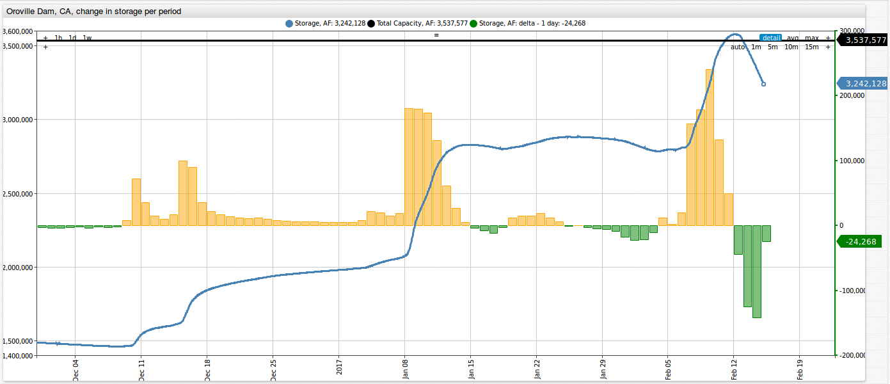
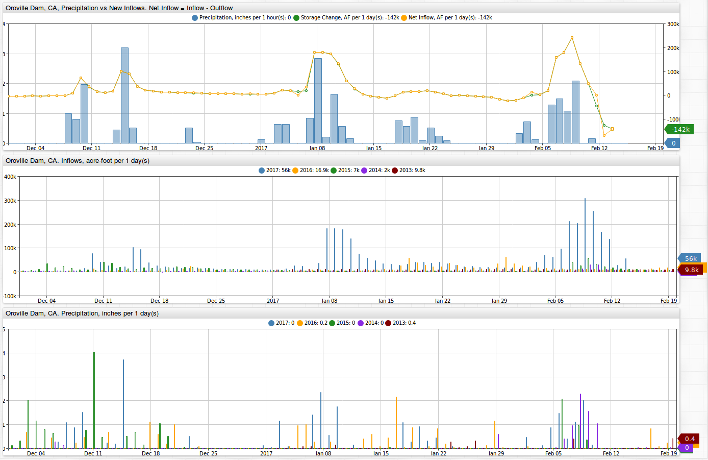

Realtime Analysis of the Oroville Dam Disaster 
==============================================

In February 2017, reservoir levels for the tallest dam in the United States, located near 
[Oroville, California](http://www.water.ca.gov/swp/facilities/Oroville/LakeDam.cfm), were beginning to reach capacity from high levels of stormwater and snowmelt. Officials decided to begin using the primary dam spillway, which
quickly began to deteriorate, and by February 10th, a hole 300 feet 
wide, 500 feet long, and 45 feet deep had appeared in the spillway. [On February 11th](http://abcnews.go.com/Technology/wireStory/latest-emergency-spillway-oroville-dam-45401080), 
officials decided to begin using an auxiliary, spillway made from earthen materials. The emergency spillway quickly began to erode and water began to spill over its concrete top. On 
February 12th, due to the "hazardous situation" surrounding the dam, more than [100,000 people](http://www.latimes.com/local/california/la-live-updates-oroville-dam-oroville-dam-spillway-expected-to-fail-1486953074-htmlstory.html)
from downstream communities were ordered to evacuate the area. 
 
In this article we will analyze a dataset from the [California Department of Water Resources (California DWR)](https://cdec.water.ca.gov/index.html) looking at the several vital statistics from the
Oroville dam. This article includes **real-time** Chart Lab graphs (updated **hourly** with data taken from the California DWR website), which show the current situation at the Oroville dam. This research article illustrates 
how publicly available data from the California DWR can be easily loaded into the non-relational [Axibase Time Series Database (ATSD)](http://axibase.com/products/axibase-time-series-database/) 
for interactive analysis with graphical representation of open data published by government organizations. 

### Oroville Dam Dataset
------------------------

Let's take a look at a dataset from the California DWR from [cdec.water.ca.gov](https://cdec.water.ca.gov/index.html). The dataset can be found here:[https://cdec.water.ca.gov/cgi-progs/queryF?s=ORO&d=13-Feb-2017+02:57&span=1year](https://cdec.water.ca.gov/cgi-progs/queryF?s=ORO&d=13-Feb-2017+02:57&span=1year). 

Data is collected hourly for the Oroville dam reservoir for the following metrics:

* Reservoir Elevation (feet)
* Reservoir Storage (acre-foot)
* Dam Outflow (cubic feet/second)
* Dam Inflow (cubic feet/second)
* Spillway Outflow (cubic feet/second)
* Rain (inches)

You can output a graph for each of these metrics by clicking on its respective header, as shown in the image below.
 

The output graph for reservoir storage from the California DWR website is shown below. You can specify a custom time span for your graph. This ouput shows minimum and maximum values
for storage for our selected timespan, in this case 2,784,813 and 3,578,686 acre-feet (af), respectively. The website's graphical outputs, however, have very little interactive features.
You cannot toggle over the series to display any of the intermediate values. Additionally, you are only able to display one metric per graph. 
 

The California DWR website does not give any options for downloading the dataset. Using programs such as Excel to process this information can provide quick answers. However, when 
it comes to complex analysis it is much more convenient to interact with the data once it is loaded into a database.  

### Axibase Time Series Database (ATSD)
---------------------------------------

The [Axibase Time Series Database (ATSD)](http://axibase.com/products/axibase-time-series-database/) is a powerful tool when it comes to storing, analyzing, and visualizing datasets. 
When loading data for a particular dataset the Axibase Collector uses Socrata metadata to understand the meaning of columns and automatically extract dates, times,
and categories from the data files. Besides, ATSD stores the data in the user's own database so that this public data can be combined with internal data
sources as well as mixed and matched across different datasets. Once you install ATSD, you **don't** have to:

* Add additional data from cdec.water.ca.gov
* Manipulate and design table schema
* Provision an application server
* Write programs to parse and digest these types of files

Rather, you can configure a scheduled job to retrieve the file from the specified endpoint and have ATSD parse it according to pre-defined rules. Once you
have raw data in ATSD, creating and sharing reports with built-in widgets is fairly trivial. The reports will be continuously updated as new data comes in.

You can load the dataset into your ATSD instance by following the steps provided at the [end of the article](/USInternationalTrade/README.md#action-items).

### The Current Situation - Realtime Analysis
---------------------------------------------

Below is a screenshot showing the change in the capacity of the Oroville dam from Saturday February 11th, 2017, to the early hours of February 14th, 2017 (the time this article was published).
The threshold capacity is **3,537,577 af**, as marked by the orange line in the image. As a note, you can scroll over horizontally and up vertically by left-clicking and dragging in the direction you
would like to shift. We can see the approximate time that the dam exceeded the threshold capacity between 2:00 and 3:00 am U.S. pacific time (PT) with 3,539,160 af recorded at 2:00 am on February 11th, and returned to 
below this limit between 11:00 pm on February 12th and 12:00 am (PT) on February 13th with 3,533,936 af recorded at midnight (both times marked below). Additionally, we can observe that the dam hit its peak capacity 
of 3,578,686 af on Sunday February 12th at 3:00 am.  
    

You can explore this portal by clicking the button below:

Below is an image showing the change in reservoir storage per hour going back to February 2016 at the Oroville dam. The blue line represents the hourly, absolute value of the 
reservoir storage, with values shown on the left hand side of the graph. Change in the dam storage is represented by the yellow and green columns: yellow represents an increase
in the reservoir storage, while green represents a decrease. These delta values are displayed on the right hand side of the graph. Hourly delta values are not shown; rather all 
hourly values are summed up and a total delta value for a single day is displayed.

Zooming into the last couple of months, we can take a look at how storage levels were changing at the time of the dam overflow.

Reservoir levels experienced their first significant uptick on December 10th, 2016, with an increase of 34,571 af added to the reservoir storage. Over the next several weeks,
the dam experienced increase in storage (with the exception for a handful of days). By toggling over each of the individual columns, we can see the change in the storage 
for February 9th (237,689 af), 10th (39,522 af), and 11th (53,896 af), which was when the dam was overtopped.      

You can explore this portal by clicking on the button below:
 

Below is an image showing dam inflow (orange) and outflow (dark green), as well as spillway outflow (light green), all given in cubic feet per second (cfs). The image below shows these values for February 14th at 3:00 am 
PT. At this time dam inflow is 30,805 cfs, dam outflow is 99,960 cfs, and spillway outflow is 118,031 cfs. The given number in light green (217,697 cfs) is the sum of the outflows.  
 

You can explore this portal by clicking on the button below:

### The Next Several Days
-------------------------

