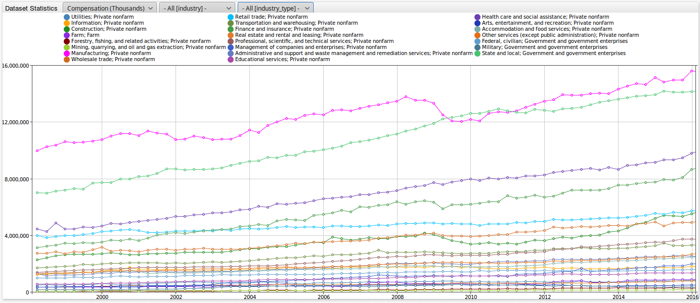
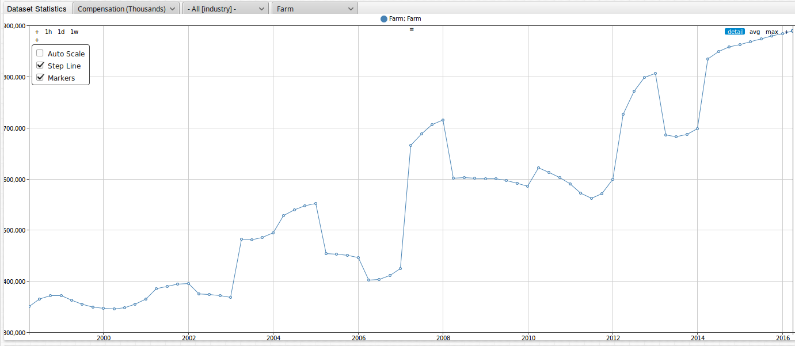
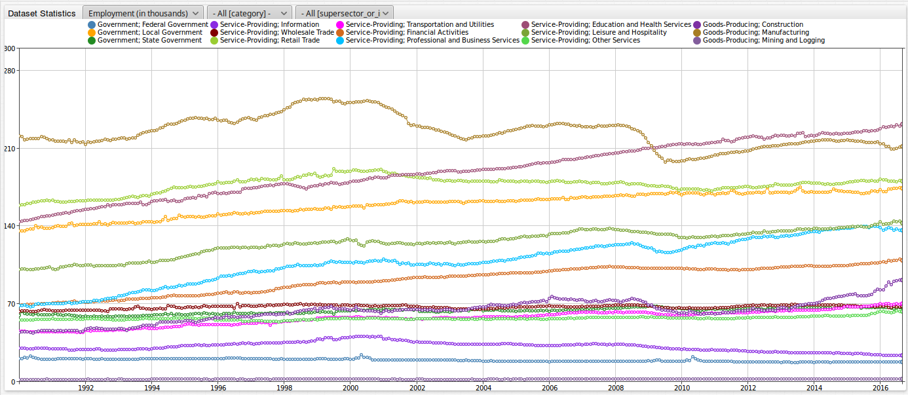
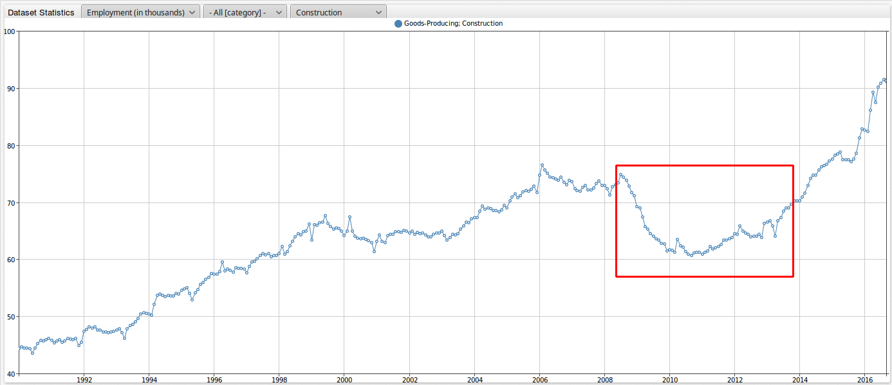
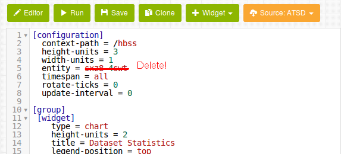
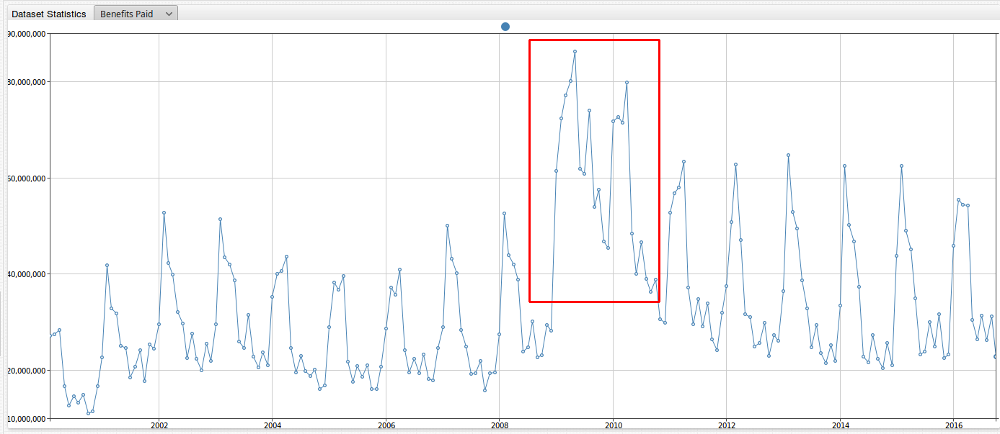

Country Living - Analyzing Employment Statistics in Iowa using Socrata Open 
===========================================================================

### Introduction
----------------

Pigs. Fields of corn. Open prairie. Small towns. These are some of the first things that come to mind when thinking about life in Iowa. While many may see this as a simpleton and
boring way of life, Iowa is one of the most financially diverse and stable states in America. According to the [US Bureau of Labor Statistics](http://www.bls.gov/news.release/laus.nr0.htm),
as of September 2016, Iowa's unemployment rate of 4.2% is lower than then US average of 5.0%. [From September of 2015 to September 2016](http://www.bls.gov/news.release/laus.t05.htm), the state of Iowa added 29,600
non-farm jobs to bring the number of non-farm employed persons in the state to 1,587,800. This amounted to a growth rate of 1.9%. The US as a whole for this same period experienced a slightly lower growth rate of 1.8%. From [2005 to 2015](http://www.deptofnumbers.com/gdp/iowa/), 
the Iowa per capita GDP grew 8.1%, compared to 3.6% for the US as a whole. According to [CNBC's America's Top States for Business 2016](http://www.cnbc.com/2016/07/12/top-states-for-business-9-iowa.html), 
Iowa was ranked as the 9th best state in the country. The state was ranked as #2 for the cost of doing business, #12 for cost of 
living, #15 for business friendliness, and #17 for education. 

In order to better analyze datasets such as **Employee Financial Compensation by Industry in Iowa**, the US government in 2009 established a data collection website, 
[data.gov](https://www.data.gov/). Datasets are available online to conduct research, develop web applications, and design data visualizations, on a variety of topics ranging 
from agriculture, to manufacturing, to health, among  many others.
  
These datasets are published using the Socrata Open Data Format. [Socrata](https://socrata.com/) is a Seattle based company that develops software for
government agencies to publish and manage their data in an open format. According to their website, the Socrata Open Data Format is used by the US
Federal government, 25 US states, 300+ US cities, and contains 4,000+ datasets for numerous US counties.

### Iowa Employee Compensation Dataset
--------------------------------------

Let us take a look at the dataset **Employee Financial Compensation by Industry in Iowa** from [data.gov](https://www.data.gov/), which looks at employee compensation by industry in Iowa.

From 1998 to the present year, the State of Iowa has compiled total state wide employee compensation estimates in thousands of dollars, seasonally adjusted at annual rates. All dollar 
estimates are in current dollars (not adjusted for inflation). Compensation is the total remuneration, both monetary and in kind, payable by employers to employees in return for 
their work during the period. Data is published for each of the following 3 industries:
  
**Farm**, **Government and government enterprises**, **Private non-farm**

In turn, each of these industries is broken down into the following subcategories:

**Farm**:  
Farm

**Government and government enterprises**:  
Federal, civilian  
Military  
State and local  

**Private non-farm**:  
Administrative and support of waste management and remediation services  
Accommodation and food services  
Arts, entertainment, and recreation  
Construction  
Educational services  
Finance and insurance  
Forestry, fishing, and related activities  
Health care and social assistance  
Information  
Management of companies and enterprises  
Manufacturing  
Mining, quarrying, and oil and gas extraction  
Professional, scientific, and technical services  
Real estate and rental and leasing  
Retail trade  
Transportation and warehousing  
Wholesale trade  
Utilities  

Other Services (except public administration)

This dataset from data.gov can be found here: [http://catalog.data.gov/dataset/employee-compensation-by-industry-in-iowa](http://catalog.data.gov/dataset/employee-compensation-by-industry-in-iowa)

On the data.gov website, datasets can be downloaded as a CSV, RDF, JSON, or a XML file. This dataset can easily be parsed into ATSD using the JSON file format.

### Axibase Time Series Database
--------------------------------

The processing of datasets using Axibase Time Series Database (ATSD) is straight forward.  Processing the same data with ATSD is less time consuming
because its collection tool has built-in heuristics to handle the format in which data.gov datasets are published, namely the Socrata Open Data Format.
When loading data for a particular dataset the collector uses Socrata metadata to understand the meaning of columns and automatically extract dates, times,
and categories from the data files. Besides, ATSD stores the data in the user's own database so that this public data can be combined with internal data
sources as well as mixed and matched across different datasets. Once you install ATSD, you **don't** have to:

* Add additional datasets from data.gov
* Manipulate and design table schema
* Provision an application server
* Write programs to parse and digest these types of files.

Rather, you can configure a scheduled job to retrieve the file from the specified endpoint and have ATSD parse it according to pre-defined rules. Once you
have raw data in ATSD, creating and sharing reports with built-in widgets is fairly trivial. The reports will be continuously updated as new data comes in.

With ATSD, the user is able display the dataset in an easily understandable manner. The below figure shows total statewide employee compensation for each of the above mentioned 23 industries.

  
Using the ATSD default portal for this particular data.gov dataset, the user has the ability to filter the data to their liking. 

The following three filters are applied to the default portal:

* First filter: allows the user to sort by compensation type. In the default portal, the only current option is to filter by thousand of US dollars. 
* Second filter: allows the user to filter between 23 industries. In the case above, all industries have been selected. 
* Third filter: allows the user to filter by industry groups (farm, government and government enterprise, and private nonfarm). In the above case, all groups have been selected.

The below figure shows the output when **farm** is selected as the **[industry_type]** from the third filter. We can see that the total employee compensation for farming can fluctuates quite
often. There does not seem to be a single pattern that repeats year over year, such as low amount of work in the winter (leading to low figures) and a high amount of work in the fall
(leading to high figures). Rather, we can see that the farming industry is very sensitive to extraneous factors (such as weather), which can plunge or skyrocket the industry's overall numbers in any 
given year.      
 

The next figure shows the output when **government and government enterprises** is selected as the **[industry_type]** from the third filter. We can see that the 
**federal, civilian** and **military** metrics are nearly constant and that **state and local** is experiencing steady growth. Unlike with the farming industry, we can see that 
government institutions are less sensitive to extraneous factors (such as poor weather, a struggling economy, or civil unrest).  

The below figure shows the output for the **private non-farm** is selected as the **[industry_type]** from the third filter.

It appears that most of these metrics are on an upward trend, but there is a lot of information displayed, so it is somewhat difficult to tell. Let us sort for the metrics **Construction** and **Manufacturing**. The images 
for these 2 outputs are shown below, respectively. We can see that both metrics were generally experiencing steady, upward growth until the late 2000's, when each metric experienced a 
sharp decline (as marked by the red boxes in the figures below). An extraneous factor at this time that may have contributed to this change was the poor world-wide economy, otherwise
known as the [Great Recession](http://stateofworkingamerica.org/great-recession/). 
 

Here, you can explore the complete dataset for employee compensation by industry in Iowa:

 

### A Deeper Look at Iowa's Economy
-----------------------------------

In order to provide context to the above dataset, we will quickly now walk through adding additional datasets to ATSD. By looking at additional information, 
we can see how the rise and fall of total statewide employee compensation corresponds to other metrics. For example, does the rise or fall of total statewide employee compensation correspond to a rise or fall of the gross number 
of employees in the state, or is there another factor at play? With a decrease in total statewide employee compensation, will unemployment rates and benefits rise as a result? To look into these 
questions, let us navigate to [https://data.iowa.gov](https://data.iowa.gov/). This site contains publicly available information pertaining to Iowa for fields such as the economy,
education, health, and the environment, among many more. Let us begin by finding a dataset which provides information on the gross number of employees working in the state.

1. Navigate to [https://data.iowa.gov](https://data.iowa.gov).
2. On the home page, select the **Employment** tab.
3. As shown in the figure below, in the **Employment** tab, scroll to the bottom of the page and click on the **Topics** drop down. Select **Employment**.

   

4. Select the dataset titled **Iowa Seasonally Adjusted Non-Farm Employment by Month and Industry**. This link can be found [here](https://data.iowa.gov/Economy/Iowa-Seasonally-Adjusted-Non-Farm-Employment-by-Mo/sxz8-4swt). 
5. As shown in the image below, click on **Download -> JSON**, which provides the dataset in the Socrata format, which can be easily processed into ATSD.

   
   
Below is an image of the dataset **Iowa Seasonally Adjusted Non-Farm Employment by Month and Industry**. Data has been compiled from 1990 to the present year. The metric shown is 
the total number of employees (in thousands) per industry. 

Data is published for each of the following industry types: **Goods producing**, **Government**, and **Service providing**.  

In turn, each of these industries is broken down into the following subcategories:

**Goods producing** 
Construction 
Manufacturing 
Mining and Logging 

**Government** 
Federal Government 
Local Government 
State Government 

**Service providing** 
Education and Health Services 
Financial Activities 
Information 
Leisure and Hospitality 
Professional and Business Services 
Retail Trade 
Transportation and Utilities 
Wholesale Trade 

Other Services

The following three filters are applied to the default portal:

* First filter: allows the user to sort by employee type. In the default portal, the only current option is to filter by thousands of employees. 
* Second filter: allows the user to filter between the 3 industry types. In the case above, all industry groups are selected. 
* Third filter: allows the user to filter by a specific industry. In the default instance, all industries are selected.

Here, you can explore the complete dataset for employment by industry in Iowa:

Let us know take a look at specific metrics in the **Iowa Seasonally Adjusted Non-Farm Employment by Month and Industry** dataset. As with the total statewide employee compensation dataset that
we looked at earlier, let us filter for the **Construction** and **Manufacturing** metrics and see how the behaviors of the 2 datasets compare. Below are images of the
**Construction** and **Manufacturing** metrics, respectively.   

As with the employee compensation dataset, we can see that these metrics were generally experiencing steady, upward growth until the late 2000's, where each metric experienced a sharp 
decline (as marked by the red boxes in the figures above). We can see that both the total employee compensation and the gross number of employees decreased in the late 2000's, likely
as a result of the **Great Recession**. Additionally, we can see there there was a significant decline in employment numbers for manufacturing between approximately 2001 and 2004. Looking
back at the total statewide employee compensation dataset, we can see that there was also a significant decline for this data around this same period. Construction, however, did not seem to
be effected nearly as much. This decline may be attributed to a economic recession (slightly less sever than the one beginning in 2008) brought on by the September 11th terrorist attacks. For
this period, it appears that the manufacturing field was greatly affected, while the construction industry was only slightly affected. 

Next, let us look at another dataset to see if there is any relation with its behavior compared to the two we just analyzed. Below is a table of datasets from data.iowa.gov that
are readily available in Chart Lab. These dataset can be loaded in Chart Lab by replacing the entity name in the default portal (Iowa Seasonally Adjusted Non-Farm Employment by Month and Industry)
with one from the table below.  

|Entity     |data.iowa.gov dataset     |
|-----------|--------------------------|
| ytnz-cckp | [Gross seasonally adjusted non-farm employment by month](https://data.iowa.gov/Economy/Iowa-Seasonally-Adjusted-Non-Farm-Employment-by-Mo/sxz8-4swt)|
| n74v-z6ct | [Average monthly non-farm employment by year and category](https://data.iowa.gov/Economy/Iowa-Seasonally-Adjusted-Non-Farm-Employment-by-Mo/sxz8-4swt)|
| jpje-kkb9 | [Unemployment insurance claims and payments (statewide - monthly)](https://data.iowa.gov/Economy/Unemployment-Insurance-Claims-And-Payments-Statewi/jpje-kkb9)|
| njph-rx66 | [Unemployment insurance claims (statewide - weekly)](https://data.iowa.gov/Economy/Unemployment-Insurance-Claims-Statewide-Weekly-/njph-rx66)|
| b38f-jgn3 | [Unemployment insurance benefit payments by industry](https://data.iowa.gov/Economy/Unemployment-Insurance-Benefit-Payments-by-Industr/b38f-jgn3)|
| yhbr-3t8a | [Unemployment insurance recipients and unemployment insurance benefit payments by county (annual)](https://data.iowa.gov/Economy/Unemployment-Insurance-Recipients-and-UI-Benefit-P/yhbr-3t8a)|
| rmcb-sifx | [Unemployment insurance payments (statewide - yearly)](https://data.iowa.gov/Economy/Unemployment-Insurance-Recipients-and-UI-Benefit-P/yhbr-3t8a)|
| rigx-2vau | [Unemployment insurance initial claims by county](https://data.iowa.gov/Economy/Unemployment-Insurance-Initial-Claims-by-County/rigx-2vau)|
| aeyn-twxp | [Unemployment insurance recipients and unemployment insurance benefit payments by county (monthly)](https://data.iowa.gov/Economy/Unemployment-Insurance-Recipients-and-UI-Benefit-P/aeyn-twxp)|

(Note: If you would like to view a data.gov dataset without installing the ATSD software, please contact us and we would be happy to add it to this table!)

Let us change the entity in the default portal to **Unemployment insurance benefit payments by industry** (the 5th entry in the above table). Follow the below steps to change the entity:

1. Open the default portal: [https://apps.axibase.com/chartlab/1ac33603](https://apps.axibase.com/chartlab/1ac33603). 
2. Delete the default entity name **sxz8-4swt**, as shown in the image below.

   

3. Enter in the new entity name, in our instance **b38f-jgn3**. 
4. Run!

Below is an image showing the output of the graph. 

As marked with red boxes in the image above for the **Construction**, **Manufacturing**, and **Administration and Support of Waste Management and Remediation Services**
metrics, we can see that insurance benefit payments tend to follow a yearly pattern. The payments tend to peak at the very beginning of the year in January, and generally fall throughout
the rest of the year. This makes sense because for a state with harsh winters like Iowa, these services can tend to slow down in the winter months, leading to companies laying off a
portion of their workforce, with these affected employees collecting unemployment insurance payments. This particular dataset however only goes back to 2010, so we cannot tell from it
whether or not there is a correlation between it and the gross number of employees in the state and the total statewide employee compensation. Let us navigate to a different dataset showing unemployment
benefits to see if there is a correlation or not.

Let us navigate **Unemployment insurance claims and payments (statewide - monthly)** with the entity **jpje-kkb9**. Below is an image showing the output of this graph. 

As with the previous figure, we can see that this dataset follows the same general trend, with the payments tending to peak in January of a given year and continue to fall throughout
the rest of the year. However, we can see that in the late 2000's, the series shifted up as marked in the above figure. To summarize, the **Great Recession** seems to have had the
following effects on each of the datasets:

* Decrease in total state employee compensation
* Decrease in total number of state employees
* Increase in total of unemployment insurance benefit payments

### Action Items
----------------

Below are the steps to follow to install ATSD and create figures for Iowa employment metrics:

1. [Install the database](https://github.com/axibase/atsd-docs/tree/master/installation#installation) on a virtual machine or in a Linux container.
2. [Install Axibase Collector](https://github.com/axibase/axibase-collector-docs/blob/master/installation.md#axibase-collector-installation) and configure it to write data into your ATSD instance.
3. Import [JSON Socrata Job](json_socrata_job.xml) into Axibase Collector.
4. Add your desired data.gov dataset to the job to enable data collection. Click on [Run] to collect data for the first time.
5. Login into ATSD and open a sample Socrata portal to explore the data.

If you require assistance in installing this software or have any questions, please feel free to [contact us](https://axibase.com/feedback/) and we would be happy to be of assistance!

