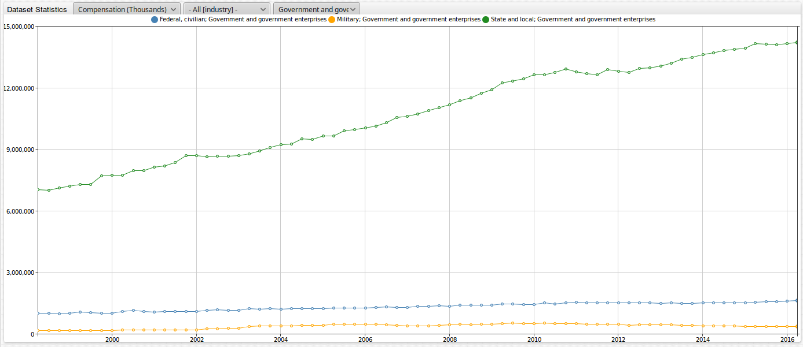
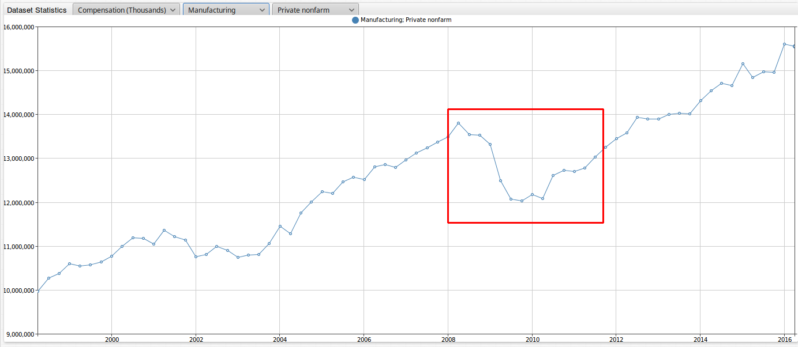
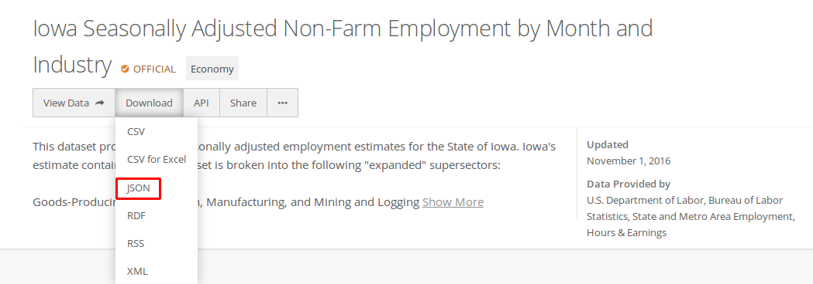
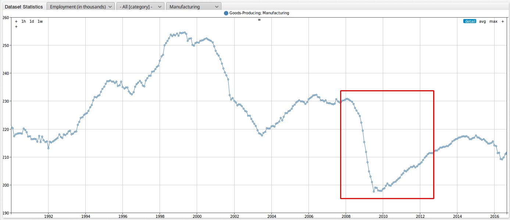

Country Living - Analyzing Employee Compensation in Iowa using Socrata Open 
===========================================================================

### Introduction
----------------

Pigs. Fields of corn. Open prairie. Small towns. These are some of the first things that come to mind when thinking about life in Iowa. While many may see this as a simpleton and
boring way of life, Iowa is one of the most financially diverse and stable states in America. According to the [US Bureau of Labor Statistics](http://www.bls.gov/news.release/laus.nr0.htm),
as of September 2016, Iowa's unemployment rate of 4.2% is lower than then US average of 5.0%. Additionally, from September of 2015 to September 2016, the state of Iowa added 29,600
jobs, which amounted to a growth rate 1.9%. 

In order to better analyze datasets such as employee financial compensation by industry in Iowa, the US government in 2009 established a data collection website, 
[data.gov](https://www.data.gov/). Datasets are available online to conduct research, develop web applications, and design data visualizations, on a variety of topics ranging 
from agriculture, to manufacturing, to health, among  many other.
  
These datasets are published using the Socrata Open Data Format. [Socrata](https://socrata.com/) is a Seattle based company that develops software for
government agencies to publish and manage their data in an open format. According to their website, the Socrata Open Data Format is used by the US
Federal government, 25 US states, 300+ US cities, and contains 4,000+ datasets for numerous US counties.

### Iowa Employee Compensation Dataset
--------------------------------------

Let us take a look at a dataset from [data.gov](https://www.data.gov/) which looks at employee compensation by industry in Iowa.

From 1998 to the present year, the State of Iowa has compiled total state wide employee compensation estimates in thousands of dollars, seasonally adjusted at annual rates. All dollar 
estimates are in current dollars (not adjusted for inflation). Compensation is the total remuneration, both monetary and in kind, payable by employers to employees in return for 
their work during the period. Data is published for each of the following 3 industries:
  
**Farm**, **Government and government enterprises**, **Private non-farm**

In turn, each of these industries is broken down into the following subcategories:

**Farm**:  
Farm

**Government and government enterprises**:  
Federal, civilian  
Military  
State and local  

**Private non-farm**:  
Administrative and support of waste management and remediation services  
Accommodation and food services  
Arts, entertainment, and recreation  
Construction  
Educational services  
Finance and insurance  
Forestry, fishing, and related activities  
Health care and social assistance  
Information  
Management of companies and enterprises  
Manufacturing  
Mining, quarrying, and oil and gas extraction  
Professional, scientific, and technical services  
Real estate and rental and leasing  
Retail trade  
Transportation and warehousing  
Wholesale trade  
Utilities  

Other Services (except public administration)

The dataset from data.gov can be found here: [http://catalog.data.gov/dataset/employee-compensation-by-industry-in-iowa](http://catalog.data.gov/dataset/employee-compensation-by-industry-in-iowa)

On the data.gov website, datasets can be downloaded as a CSV, RDF, JSON, or a XML file. This dataset can easily be parsed into ATSD using the JSON file format.

### Axibase Time Series Database
--------------------------------

The processing of datasets using Axibase Time Series Database (ATSD) is straight forward.  Processing the same data with ATSD is less time consuming
because its collection tool has built-in heuristics to handle the format in which data.gov datasets are published, namely the Socrata Open Data Format.
When loading data for a particular dataset the collector uses Socrata metadata to understand the meaning of columns and automatically extract dates, times,
and categories from the data files. Besides, ATSD stores the data in the user's own database so that this public data can be combined with internal data
sources as well as mixed and matched across different datasets. Once you install ATSD, you **don't** have to:

* Add additional datasets from data.gov
* Manipulate and design table schema
* Provision an application server
* Write programs to parse and digest these types of files.

Rather, you can configure a scheduled job to retrieve the file from the specified endpoint and have ATSD parse it according to pre-defined rules. Once you
have raw data in ATSD, creating and sharing reports with built-in widgets is fairly trivial. The reports will be continuously updated as new data comes in.

With ATSD, the user is able display the dataset in an easily understandable manner. The below figure shows employee compensation for each of the 23 industries.

  
Using the ATSD default portal for this particular data.gov dataset, the user has the ability to filter for employee compensation by industry in Iowa to their liking. 

The following three filters are applied to the default portal:

* First filter: allows the user to sort by compensation type. In the default portal, the only current option is to filter by thousand of US dollars. 
* Second filter: allows the user to filter between 23 industries. In the case above, all industries have been selected. 
* Third filter: allows the user to filter by industry groups (far, government and government enterprise, and private nonfarm). In the above case, all groups have been selected.

The dataset can be sorted by industry group (farm, government and government enterprises, and private non-farm) or specific industry, and the user can easily toggle through 
comparing different scenarios. 

The below figure shows the output when **farm** is selected as the **[industry_type]** from the third filter. We can see that the total compensation for farming can fluctuates quite
often. There does not seem to be a single pattern that repeats year over year, such as low amount of work in the winter (leading to low figures) and a high amount of work in the fall
(leading to high figures). Rather, we can see that the farming industry is very sensitive to extraneous factors (such as bad weather), which can plunge the industry's overall numbers.      
 

The next figure shows the output when **government and government enterprises** is selected as the **[industry_type]** from the third filter. We can see that the 
**federal, civilian** and **military** metrics are nearly constant and that **state and local** is experiencing steady growth. Unlike with the farming industry, we can see that 
government institutions are less sensitive to extraneous factors (such as bead weather, a poor economy, or civil unrest).  

The below figure shows the output for the private non-farm industry group as a whole.

It appears that most of these metrics are on an upward trend, but it is somewhat difficult to tell. Let us sort for the metrics **Construction** and **Manufacturing**. These images 
for these 2 outputs are shown below, respectively. We can see that both metrics were experiencing steady, upward growth until the late 2000's, where each both metric experienced a 
sharp decline (as marked by the red boxes in the figures below). An extraneous factor at this time that may have contributed to this change was the poor world-wide economy, otherwise
known as the "Great Recession."
 

Here, you can explore the complete dataset for employee compensation by industry in Iowa:

 

### A Deeper Look at Iowa's Economy
-----------------------------------

In order to provide context to the above dataset, we will now walk through adding additional datasets. By looking at additional information, 
we can see how the rise and fall of employee compensation corresponds to other metrics. For example, does the rise or fall of employee compensation correspond to a rise or fall of the gross number 
of employees in the state, or is there another factor at play? With a decrease in employee compensation, will unemployment rates and benefits rise as a result? To look into these 
questions, let us navigate to [https://data.iowa.gov](https://data.iowa.gov/). This site contains publicly available information pertaining to Iowa for fields such as the economy,
education, health, and the environment, among many more fields. Let us begin by finding a dataset which provides information on the gross number of employees working in the state.

1. Navigate to [https://data.iowa.gov](https://data.iowa.gov).
2. On the home page, select the **Employment** tab.
3. As shown in the figure below, in the **Employment** tab, scroll to the bottom of the page and click on the **Topics** drop down. Select **Employment**.

   

4. Select the dataset titled **Iowa Seasonally Adjusted Non-Farm Employment by Month and Industry**. This link can be found [here](https://data.iowa.gov/Economy/Iowa-Seasonally-Adjusted-Non-Farm-Employment-by-Mo/sxz8-4swt). 
5. As shown in the image below, click on **Download -> JSON**, which provides the dataset in the Socrata format, which can be easily processed using ATSD.

   
   
Below is an image of the dataset **Iowa Seasonally Adjusted Non-Farm Employment by Month and Industry**. Data has been compiled from 1990 to the present year. The metric shown is 
the total number of employees (in thousands) per industry. 

Data is published for each of the following industry types: **Goods producing**, **Government**, and **Service providing**.  

In turn, each of these industries is broken down into the following subcategories:

**Goods producing** 
Construction 
Manufacturing 
Mining and Logging 

**Government** 
Federal Government 
Local Government 
State Government 

**Service providing** 
Education and Health Services 
Financial Activities 
Information 
Leisure and Hospitality 
Professional and Business Services 
Retail Trade 
Transportation and Utilities 
Wholesale Trade 

Other Services

The following three filters are applied to the default portal:

* First filter: allows the user to sort by employee type. In the default portal, the only current option is to filter by thousands of employees. 
* Second filter: allows the user to filter between 3 industry types. In the case above, all industry groups are selected. 
* Third filter: allows the user to filter by a specific industry. In the default instance, all industries are selected.

Here, you can explore the complete dataset for employee compensation by industry in Iowa:

Let us know take a look at specific metrics in the **Iowa Seasonally Adjusted Non-Farm Employment by Month and Industry** dataset. As with the employee compensation dataset that
we looked at earlier, let us filter for the **Construction** and **Manufacturing** metrics and see how the behaviors of the 2 datasets compare. Below are images of the
**Construction** and **Manufacturing** metrics, respectively.   

As with the employee compensation dataset, we can see that these metrics were experiencing steady, upward growth until the late 2000's, where each both metric experienced a sharp 
decline (as marked by the red boxes in the figures above). We can see that both the total employee compensation and the gross number of employees decreased in the late 2000's, likely
as a result of the "Great Recession."

Next, let us look at another dataset to see if there is any relation with its behavior compared to the two we just analyzed. Below is a table of datasets from data.iowa.gov, that
are readily available in Chart Lab. 

|Entity     |data.iowa.gov dataset     |
|-----------|--------------------------|
| ytnz-cckp | [Gross seasonally adjusted non-farm employment by month](https://data.iowa.gov/Economy/Iowa-Seasonally-Adjusted-Non-Farm-Employment-by-Mo/sxz8-4swt)|
| n74v-z6ct | [Average monthly non-farm employment by year and category](https://data.iowa.gov/Economy/Iowa-Seasonally-Adjusted-Non-Farm-Employment-by-Mo/sxz8-4swt)|
| jpje-kkb9 | [Unemployment insurance claims and payments (statewide - monthly)](https://data.iowa.gov/Economy/Unemployment-Insurance-Claims-And-Payments-Statewi/jpje-kkb9)|
| njph-rx66 | [Unemployment insurance claims (statewide - weekly)](https://data.iowa.gov/Economy/Unemployment-Insurance-Claims-Statewide-Weekly-/njph-rx66)|
| b38f-jgn3 | [Unemployment insurance benefit payments by industry](https://data.iowa.gov/Economy/Unemployment-Insurance-Benefit-Payments-by-Industr/b38f-jgn3)|
| yhbr-3t8a | [Unemployment insurance recipients and unemployment insurance benefit payments by county (annual)](https://data.iowa.gov/Economy/Unemployment-Insurance-Recipients-and-UI-Benefit-P/yhbr-3t8a)|
| rmcb-sifx | Benefits|
| rigx-2vau | [Unemployment insurance initial claims by county](https://data.iowa.gov/Economy/Unemployment-Insurance-Initial-Claims-by-County/rigx-2vau)|
| aeyn-twxp | [Unemployment insurance recipients and unemployment insurance benefit payments by county (monthly)](https://data.iowa.gov/Economy/Unemployment-Insurance-Recipients-and-UI-Benefit-P/aeyn-twxp)|

