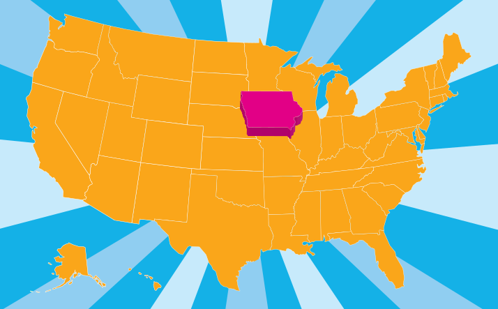

Country Living: Analyzing Financial Compensation in Iowa using Socrata Open Data
================================================================================

### Introduction
----------------

Pigs. Fields of corn. Open prairie. Small towns. These are some of the first things that come to mind when thinking about life in Iowa. While many may see this as a simpleton and
boring way of life, Iowa is one of the most financially diverse and stable states in America and often voted as one of the top states to live in. According to

In order to better analyze datasets such as employee financial compensation by industry, the US government in 2009 established a data collection website, 
[data.gov](https://www.data.gov/). Datasets are available online to conduct research, develop web applications, and design data visualizations, on a variety of topics ranging 
from agriculture, to manufacturing, to health, among  many other.
  
These datasets are published using the Socrata Open Data Format. [Socrata](https://socrata.com/) is a Seattle based company that develops software for
government agencies to publish and manage their data in an open format. According to their website, the Socrata Open Data Format is used by the US
Federal government, 25 US states, 300+ US cities, and contains 4,000+ datasets for numerous US counties. 

### Axibase Time Series Database
--------------------------------
  
Using the ATSD default portal for this particular data.gov dataset, the user has the ability to filter for employee compensation by industry in Iowa to their liking. 

The following three filters are applied to the default portal:

* First filter: allows the user to sort by compensation type. In the default portal, the only current option is to filter by thousand of US dollars. 
* Second filter: allows the user to filter between 23 industries. In the case below, all industries have been selected. 
* Third filter: allows the user to filter by industry groups (far, government and government enterprise, and private nonfarm). In this case, all groups have been selected.