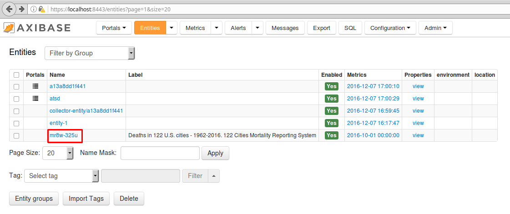

Creating Local Configurations for ATSD and Axibase Collector using Docker
=========================================================================

Below is a step-by-step walk through for setting up local configurations of ATSD and Axibase Collector. We will use Docker as our host.

1. Install Docker. A link for how to install Docker can be found [here](https://docs.docker.com/engine/installation/linux/ubuntulinux/). 
2. Copy the `docker-compose.yml` file which can be found [here](resources/docker-compose.yml). Save this file to whichever directory you are using
   in Terminal (i.e. Desktop, Documents).
3. In Terminal, launch containers with the below command:

   ```sql
   export C_USER=myuser; export C_PASSWORD=mypassword; docker-compose pull && docker-compose up -d
   ```
   
4. Access the ATSD user interface by navigating to `https://localhost:8443`. Note that it may take several minutes for the containers to launch and for ATSD to become
   available. Create a username and password.

   

5. After completing Step 4, you will be redirected to the page shown below. Login to ATSD with the username and password you just created.

    
   
6. Now, navigate to the **Entities** tab in ATSD. We can see that the job has created a new entity in ATSD, with the name `mr8w-325u`. Note that it may take a minute or two for the label **Deaths 
   in 122 U.S. cities - 1962-2016. 122 Cities Mortality Reporting System** to show up in ATSD.  
   
   
   
7. Click on **Configuration -> Replacement Tables**.
   
   
   
8. Copy and paste the files included in this repository ([`city-size`](https://github.com/axibase/atsd-use-cases/blob/master/USMortality/resources/city-size), [`us-regions`](https://github.com/axibase/atsd-use-cases/blob/master/USMortality/resources/us-regions), 
   [`new-york-city-2010-population`](https://github.com/axibase/atsd-use-cases/blob/master/USMortality/resources/new-york-city-2010-population), and [`youngstown-2010-population`](https://github.com/axibase/atsd-use-cases/blob/master/USMortality/resources/youngstown-2010-population))
   into the Replacement Table. Click **Save**. `city-size` contains 2015 population figures for each of the 122 cities included in this dataset. `us-regions` is a list of all of the regions 
   (i.e. 1=New-England, 2=Middle-Atlantic etc.). `new-york-city-2010-population` and `youngstown-2010-population` will be used to compute mortality statistics. 
   
   
   
9. Navigate to **Configuration -> Parsers:CSV** and import the [`parser.xml`](https://github.com/axibase/atsd-use-cases/blob/master/USMortality/resources/parser.xml) file.
 
   
   
   
   
   
   
10. After the parser has been added, we will proceed to uploading our [`us.population.csv`](https://github.com/axibase/atsd-use-cases/blob/master/USMortality/resources/us.population.csv) file. 
    This file contains population estimates from [census.gov](https://http://www.census.gov/data.html) for all 122 cities for 1960, 1970, 1980, 1990, 2000, 2010,
    and 2015. **Save** a local copy of this file. Click on the **Parsers:CSV** dropdown, and then on the **Upload** button and select our `us.population.csv` file.          
   
   
   
   
   
   Click on the **To submitted tasks** button.
   
   
   
   If the upload was success, you should see something like the below image. 
   
   
   
11. Next, navigate to **Metrics** and enter in `us.population` into the **Name Mask** bar.     
   
   
   
   Select **Series**. If the data was parsed successfully, you should see something like the second image. 
   
   
   
   
   
We are now ready to begin querying our dataset.